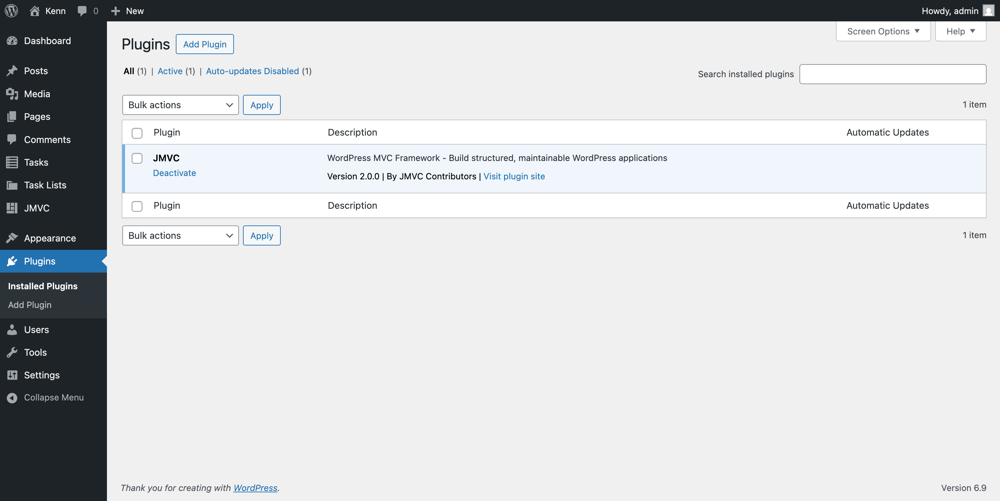
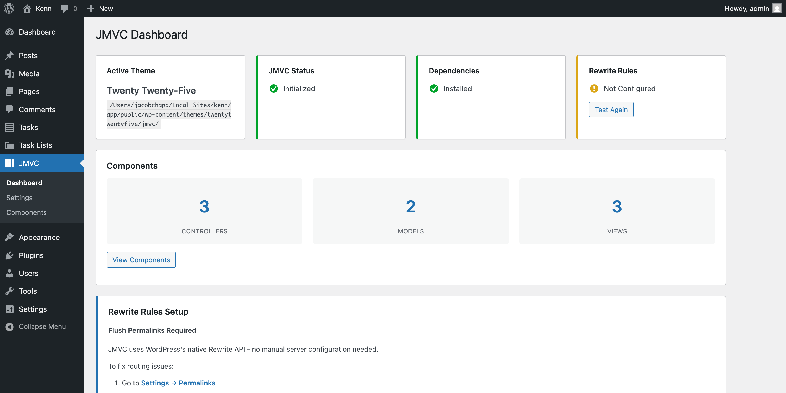
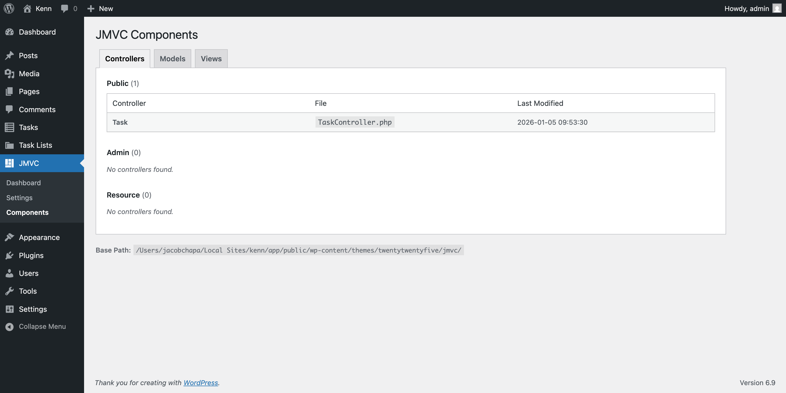
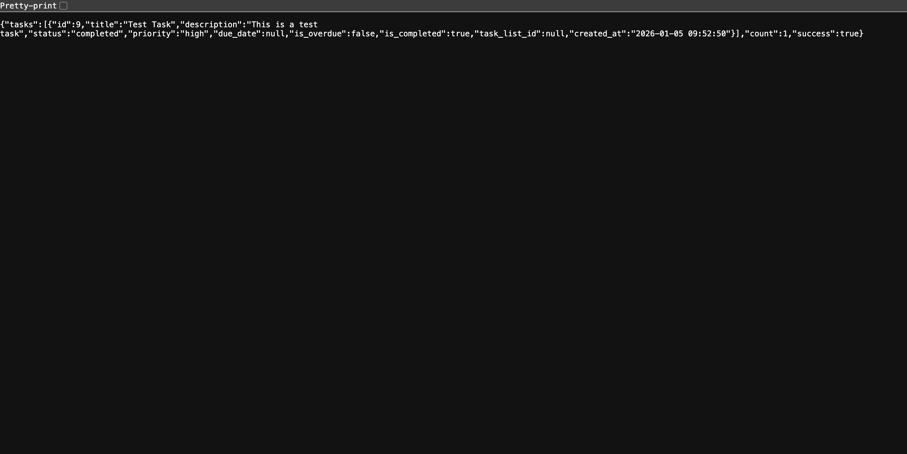
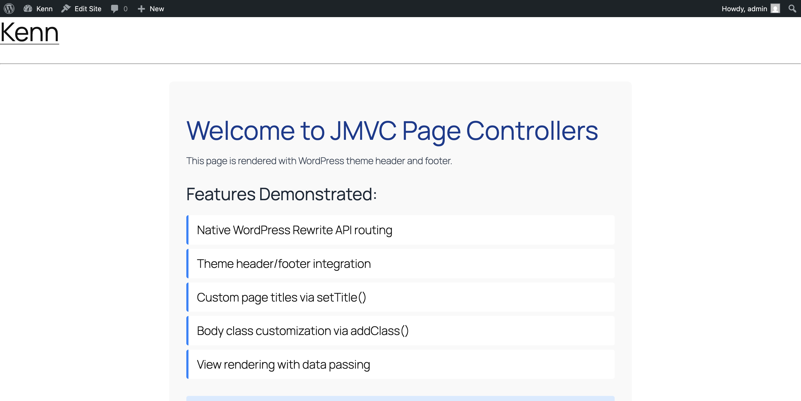
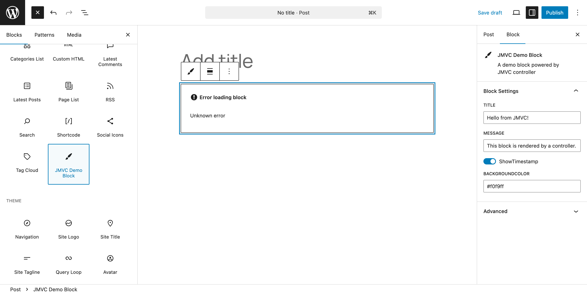
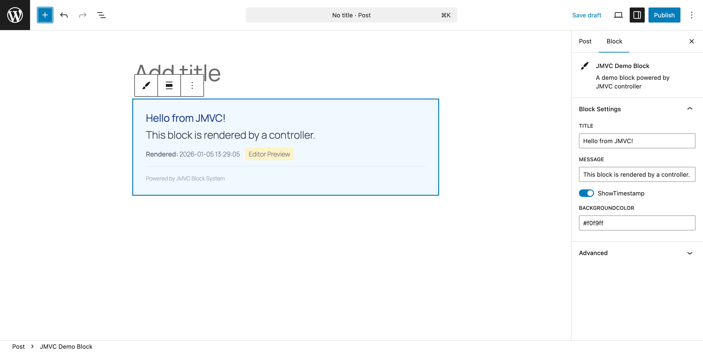

# JMVC

**A WordPress MVC Framework for Building Structured Applications**

JMVC brings the Model-View-Controller pattern to WordPress, enabling developers to build organized, maintainable applications with clean separation of concerns. Built with support for AJAX routing, Advanced Custom Fields integration, and hierarchical modular architecture (HMVC).

---

## Table of Contents

- [Features](#features)
- [Requirements](#requirements)
- [Installation](#installation)
- [Admin Dashboard](#admin-dashboard)
- [Quick Start](#quick-start)
- [Architecture Overview](#architecture-overview)
- [Core Components](#core-components)
  - [Controllers](#controllers)
  - [Models](#models)
  - [Views](#views)
  - [Libraries](#libraries)
  - [Configuration](#configuration)
- [Routing](#routing)
- [Page Controllers](#page-controllers)
- [Gutenberg Blocks](#gutenberg-blocks)
- [REST API](#rest-api)
- [Security Features](#security-features)
- [Environment Configuration](#environment-configuration)
- [Sample Application: Task Manager](#sample-application-task-manager)
- [Developer Tools](#developer-tools)
- [HMVC Modules](#hmvc-modules)
- [API Reference](#api-reference)
- [Testing](#testing)
- [Contributing](#contributing)
- [License](#license)

---

## Features

- **MVC Architecture** - Clean separation of Models, Views, and Controllers
- **WordPress Plugin** - Install once, use in any theme
- **Admin Dashboard** - Initialize, configure, and manage via WordPress admin
- **WordPress Integration** - Native support for custom post types and WordPress APIs
- **ACF Integration** - Seamless Advanced Custom Fields support via traits
- **AJAX Routing** - Built-in URL routing through WordPress AJAX handlers
- **REST API Support** - Modern REST API endpoints alongside AJAX routing
- **HMVC Support** - Build modular, self-contained components
- **API Development** - Ready-to-use base controller for JSON APIs
- **Developer Tools** - Logging (JLog) and error alerting (DevAlert) built-in
- **Key-Value Store** - Redis or SQLite backend for caching and sessions
- **Flexible Configuration** - GUI-based config management with nested access
- **Security Built-in** - Nonce verification, CSRF protection, input sanitization, and output escaping

---

## Requirements

- **PHP** 8.0 or higher (8.1+ recommended)
- **WordPress** 6.0 or higher
- **Composer** for dependency management

### Dependencies

- **Predis** ^2.0 - Redis client (optional)

### Optional (Recommended)

- **Advanced Custom Fields (ACF)** - For model field management
- **Redis** or **SQLite** - For kvstore backend

---

## Installation

### 1. Install the Plugin

**Option A: Download**
1. Download the latest release from GitHub
2. Extract to `/wp-content/plugins/jmvc/`

**Option B: Clone**
```bash
cd /path/to/wordpress/wp-content/plugins/
git clone https://github.com/your-repo/jmvc.git
```

### 2. Activate the Plugin

1. Go to **Plugins** in WordPress admin
2. Find "JMVC" and click **Activate**



### 3. Initialize JMVC in Your Theme

1. Go to **JMVC > Dashboard** in the admin menu
2. Click **Initialize JMVC** to create the scaffolding in your active theme
3. Click **Install Dependencies** to run Composer (or follow manual instructions if shell access is unavailable)



### 4. Configure Rewrite Rules (if needed)

The JMVC dashboard automatically tests if rewrite rules are working. If not, it will display server-specific instructions:

**Apache (.htaccess):**

```apache
# Add before WordPress rules
# JMVC Controller Routing
RewriteRule ^controller/(.*)$ /wp-admin/admin-ajax.php?action=pub_controller&path=$1 [L,QSA]
RewriteRule ^admin_controller/(.*)$ /wp-admin/admin-ajax.php?action=admin_controller&path=$1 [L,QSA]
RewriteRule ^resource_controller/(.*)$ /wp-admin/admin-ajax.php?action=resource_controller&path=$1 [L,QSA]

# HMVC Module Routing
RewriteRule ^hmvc_controller/(.*)$ /wp-admin/admin-ajax.php?action=hmvc_controller&path=$1 [L,QSA]
```

**NGINX:**

```nginx
# JMVC Controller Routing
location /controller/ {
    rewrite ^/controller/(.*)$ /wp-admin/admin-ajax.php?action=pub_controller&path=$1 last;
}

location /admin_controller/ {
    rewrite ^/admin_controller/(.*)$ /wp-admin/admin-ajax.php?action=admin_controller&path=$1 last;
}

location /resource_controller/ {
    rewrite ^/resource_controller/(.*)$ /wp-admin/admin-ajax.php?action=resource_controller&path=$1 last;
}
```

---

## Admin Dashboard

JMVC provides a full admin interface for managing your application.

### Dashboard (JMVC > Dashboard)

The main dashboard shows:

- **Theme Status** - Active theme name and JMVC initialization status
- **Dependencies** - Composer vendor folder status with install button
- **Rewrite Rules** - Auto-test with server-specific instructions if not configured
- **Component Counts** - Number of controllers, models, and views

**Actions:**
- **Initialize JMVC** - Creates scaffolding directories in your theme
- **Install Dependencies** - Runs `composer install` (or shows manual instructions)
- **Test Rewrite** - Re-checks rewrite rule configuration

### Settings (JMVC > Settings)

Configure JMVC options via UI:

**Developer Alerts**
- Email address for error notifications
- Slack webhook URL, channel, and bot username

**Key-Value Store**
- Storage type (SQLite or Redis)

Settings are saved to PHP config files in your theme's `jmvc/config/` directory.


### Components Browser (JMVC > Components)

Browse all your MVC components:

- **Controllers Tab** - View public, admin, and resource controllers
- **Models Tab** - View all models
- **Views Tab** - Browse view templates in a tree structure



---

## Quick Start

### Create Your First Controller

After initializing JMVC, create a controller in your theme:

```php
<?php
// {theme}/jmvc/controllers/pub/HelloController.php

class HelloController {

    /**
     * Basic action - outputs text
     * URL: /controller/pub/Hello/index
     */
    public function index() {
        echo "Hello, JMVC!";
    }

    /**
     * Action with parameter
     * URL: /controller/pub/Hello/greet/John
     */
    public function greet($name) {
        echo "Hello, " . esc_html($name) . "!";
    }

    /**
     * Render a view
     * URL: /controller/pub/Hello/welcome
     */
    public function welcome() {
        $data = [
            'title' => 'Welcome to JMVC',
            'message' => 'Build WordPress apps with MVC!'
        ];
        JView::show('hello/welcome', $data);
    }
}
```

### Create a View

```php
<?php // {theme}/jmvc/views/hello/welcome.php ?>
<!DOCTYPE html>
<html>
<head>
    <title><?= esc_html($title) ?></title>
</head>
<body>
    <h1><?= esc_html($title) ?></h1>
    <p><?= esc_html($message) ?></p>
</body>
</html>
```

### Access Your Controller

Visit these URLs (adjust domain as needed):

- `https://yoursite.com/controller/pub/Hello/index`
- `https://yoursite.com/controller/pub/Hello/greet/World`
- `https://yoursite.com/controller/pub/Hello/welcome`

Or use the REST API:

- `https://yoursite.com/wp-json/jmvc/v1/pub/Hello/index`

---

## Architecture Overview

### Directory Structure

JMVC splits between the plugin (framework core) and your theme (application code):

```
/wp-content/plugins/jmvc/           # Framework Core (Plugin)
├── jmvc.php                        # Plugin entry point
├── system/                         # Core framework classes
│   ├── boot.php                    # Bootstrap
│   ├── JBag.php                    # Service locator
│   ├── config/JConfig.php          # Configuration manager
│   ├── controller/
│   │   ├── JController.php         # Controller loader
│   │   └── JControllerAjax.php     # AJAX routing
│   ├── model/
│   │   ├── JModel.php              # Model loader
│   │   ├── JModelBase.php          # Base model class
│   │   └── ACFModelTrait.php       # ACF integration
│   ├── view/JView.php              # View renderer
│   ├── routing/                    # WordPress Rewrite API routing
│   │   ├── JRouter.php             # Rewrite rule registration
│   │   └── JPageController.php     # Page controller base class
│   ├── blocks/                     # Gutenberg block system
│   │   ├── JBlock.php              # Block registration
│   │   └── JBlockController.php    # Block controller base class
│   └── app/dev/
│       ├── JLog.php                # Logging
│       └── DevAlert.php            # Error alerts
├── admin/                          # Admin panel
│   ├── Admin.php                   # Menu & AJAX handlers
│   ├── Installer.php               # Scaffolding installer
│   ├── ConfigWriter.php            # Config file generator
│   ├── Browser.php                 # Component scanner
│   ├── RewriteTest.php             # Rewrite tester
│   ├── views/                      # Admin templates
│   └── assets/                     # Admin CSS/JS
├── controllers/pub/
│   └── JmvcController.php          # Health check endpoint
└── assets/js/global.js.php         # JavaScript helpers

/wp-content/themes/{your-theme}/jmvc/   # Your Application (Theme)
├── controllers/                    # MVC Controllers
│   ├── pub/                        # Public/frontend controllers
│   ├── admin/                      # Admin-only controllers
│   └── resource/                   # Resource/API controllers
├── models/                         # MVC Models
├── views/                          # MVC Views (templates)
│   └── blocks/                     # Block view templates
├── libraries/                      # Reusable service classes
├── modules/                        # HMVC modules (optional)
├── config/                         # Configuration files
│   ├── devalert.php                # Alert settings
│   ├── kvstore.php                 # Key-value store config
│   └── blocks.php                  # Gutenberg block registrations
├── templates/                      # Page templates (for JView::showPage)
├── composer.json                   # Dependencies
└── vendor/                         # Composer packages
```

### Request Flow

```
┌─────────────────────────────────────────────────────────────────┐
│                        HTTP Request                              │
│         /controller/pub/Task/show/123                           │
└─────────────────────────────────────────────────────────────────┘
                              │
                              ▼
┌─────────────────────────────────────────────────────────────────┐
│                    WordPress AJAX Handler                        │
│              wp_ajax_pub_controller                              │
└─────────────────────────────────────────────────────────────────┘
                              │
                              ▼
┌─────────────────────────────────────────────────────────────────┐
│                      JControllerAjax                             │
│           Parses URL: env=pub, controller=Task,                  │
│                    function=show, params=[123]                   │
└─────────────────────────────────────────────────────────────────┘
                              │
                              ▼
┌─────────────────────────────────────────────────────────────────┐
│                        JController                               │
│     Loads {theme}/jmvc/controllers/pub/TaskController.php       │
│              Instantiates TaskController                         │
└─────────────────────────────────────────────────────────────────┘
                              │
                              ▼
┌─────────────────────────────────────────────────────────────────┐
│                      TaskController                              │
│                    $controller->show(123)                        │
│                                                                  │
│    ┌──────────────┐    ┌──────────────┐    ┌──────────────┐    │
│    │    JModel    │    │    JView     │    │   Response   │    │
│    │  Load Task   │───▶│  Render HTML │───▶│   Output     │    │
│    │   Model      │    │  or JSON     │    │              │    │
│    └──────────────┘    └──────────────┘    └──────────────┘    │
└─────────────────────────────────────────────────────────────────┘
```

---

## Core Components

### Controllers

Controllers handle incoming requests and coordinate between models and views.

#### Loading Controllers

```php
// Load a controller manually (rarely needed - routing handles this)
$controller = JController::load('Task', 'pub');
$controller->index();

// With HMVC module
$controller = JController::load('Task', 'pub', 'mymodule');
```

#### Controller Environments

| Environment | Directory | WordPress Hook | Use Case |
|-------------|-----------|----------------|----------|
| `pub` | `controllers/pub/` | `wp_ajax_pub_controller`, `wp_ajax_nopriv_pub_controller` | Public endpoints (logged in or not) |
| `admin` | `controllers/admin/` | `wp_ajax_admin_controller` | Admin-only endpoints |
| `resource` | `controllers/resource/` | `wp_ajax_resource_controller`, `wp_ajax_nopriv_resource_controller` | Static resources, files |

#### APIController

Extend `APIController` for JSON API endpoints:

```php
<?php
// controllers/pub/ProductAPIController.php

class ProductAPIController extends APIController {

    /**
     * Return JSON success response
     */
    public function list() {
        $products = Product::find(['posts_per_page' => 10]);

        $this->api_success([
            'products' => $products,
            'count' => count($products)
        ]);
    }

    /**
     * Return JSON error response
     */
    public function show($id) {
        $product = new Product($id);

        if (!$product->ID) {
            $this->api_die('Product not found', ['id' => $id]);
        }

        $this->api_success(['product' => $product]);
    }
}
```

**APIController Methods:**

| Method | Description |
|--------|-------------|
| `api_success($result)` | Output `{"success": true, "result": ...}` |
| `api_die($message, $data)` | Output `{"success": false, "error": ...}` and exit |
| `api_result($success, $result)` | Output custom success/fail response |
| `extractFields($data, $fields)` | Filter response to specific fields |
| `cleanParams($params)` | Convert string booleans, parse field lists |

---

### Models

Models represent your data and business logic, with built-in WordPress post type integration.

#### Basic Model

```php
<?php
// models/Product.php

class Product extends JModelBase {
    use ACFModelTrait;

    // Link to WordPress custom post type
    public static $post_type = 'product';

    /**
     * Custom business logic
     */
    public function isOnSale() {
        return $this->sale_price && $this->sale_price < $this->regular_price;
    }

    /**
     * Calculate discount percentage
     */
    public function getDiscountPercent() {
        if (!$this->isOnSale()) return 0;
        return round((1 - $this->sale_price / $this->regular_price) * 100);
    }
}
```

#### Loading Models

```php
// Load model class
JModel::load('Product');

// Create new instance
$product = new Product();

// Load existing by ID
$product = new Product(123);

// Get singleton instance
$product = JModel::load('Product', null, true);
```

#### Querying Records

```php
// Find all products
$products = Product::find();

// With WordPress query args
$products = Product::find([
    'posts_per_page' => 10,
    'orderby' => 'date',
    'order' => 'DESC',
    'meta_query' => [
        [
            'key' => 'featured',
            'value' => '1'
        ]
    ]
]);
```

#### Creating & Updating Records

```php
// Create new record
$product = new Product();
$product->post_title = 'New Product';
$product->post_content = 'Description here';
$product->regular_price = 99.99;
$product->sale_price = 79.99;
$id = $product->add();

// Update existing record
$product = new Product(123);
$product->regular_price = 89.99;
$product->save();

// Update specific fields
$product->update(['regular_price' => 89.99]);
```

#### Magic Properties

Models automatically map to WordPress post attributes and ACF fields:

```php
$product = new Product(123);

// WordPress post attributes
echo $product->post_title;      // Post title
echo $product->post_content;    // Post content
echo $product->post_date;       // Created date
echo $product->ID;              // Post ID

// ACF fields (via ACFModelTrait)
echo $product->regular_price;   // get_field('regular_price', 123)
echo $product->sale_price;      // get_field('sale_price', 123)
echo $product->product_image;   // get_field('product_image', 123)
```

---

### Views

Views are PHP templates for rendering HTML output.

#### Rendering Views

```php
// Output view directly
JView::show('products/list', [
    'products' => $products,
    'title' => 'Our Products'
]);

// Get view as string (for emails, AJAX, etc.)
$html = JView::get('emails/order-confirmation', [
    'order' => $order,
    'customer' => $customer
]);
```

#### View Template

```php
<?php // views/products/list.php ?>
<div class="product-listing">
    <h1><?= esc_html($title) ?></h1>

    <?php if (empty($products)): ?>
        <p>No products found.</p>
    <?php else: ?>
        <div class="products-grid">
            <?php foreach ($products as $product): ?>
                <?php JView::show('products/partials/card', ['product' => $product]); ?>
            <?php endforeach; ?>
        </div>
    <?php endif; ?>
</div>
```

#### View Partials

```php
<?php // views/products/partials/card.php ?>
<div class="product-card">
    <h3><?= esc_html($product->post_title) ?></h3>

    <?php if ($product->isOnSale()): ?>
        <span class="badge sale">Save <?= $product->getDiscountPercent() ?>%</span>
        <p class="price">
            <del>$<?= number_format($product->regular_price, 2) ?></del>
            <strong>$<?= number_format($product->sale_price, 2) ?></strong>
        </p>
    <?php else: ?>
        <p class="price">$<?= number_format($product->regular_price, 2) ?></p>
    <?php endif; ?>

    <a href="<?= get_permalink($product->ID) ?>">View Details</a>
</div>
```

---

### Libraries

Libraries are reusable service classes for shared functionality.

#### Creating a Library

```php
<?php
// libraries/EmailService.php

class EmailService {

    private $from_email;
    private $from_name;

    public function __construct() {
        $this->from_email = JConfig::get('email/from_address');
        $this->from_name = JConfig::get('email/from_name');
    }

    public function send($to, $subject, $template, $data = []) {
        $body = JView::get('emails/' . $template, $data);

        $headers = [
            'Content-Type: text/html; charset=UTF-8',
            "From: {$this->from_name} <{$this->from_email}>"
        ];

        return wp_mail($to, $subject, $body, $headers);
    }

    public function sendOrderConfirmation($order) {
        return $this->send(
            $order->customer_email,
            'Order Confirmation #' . $order->ID,
            'order-confirmation',
            ['order' => $order]
        );
    }
}
```

#### Loading Libraries

```php
// Load library (returns singleton)
$email = JLib::load('EmailService');
$email->sendOrderConfirmation($order);

// Load from subdirectory
$payment = JLib::load('payments/StripeService');

// Load from HMVC module
$service = JLib::load('CustomService', 'mymodule');
```

---

### Configuration

Configuration can be managed via the admin UI (JMVC > Settings) or by editing config files directly.

#### Config File Structure

```php
<?php
// config/app.php

return [
    'name' => 'My Application',
    'version' => '1.0.0',
    'debug' => WP_DEBUG,

    'email' => [
        'from_address' => 'noreply@example.com',
        'from_name' => 'My App'
    ],

    'pagination' => [
        'per_page' => 20,
        'max_per_page' => 100
    ]
];
```

#### Accessing Configuration

```php
// Get single value
$appName = JConfig::get('app/name');

// Get nested value
$fromEmail = JConfig::get('app/email/from_address');

// Get with default
$perPage = JConfig::get('app/pagination/per_page') ?: 10;

// Set value at runtime
JConfig::set('app/debug', true);
```

#### Global Storage (JBag)

For runtime service storage:

```php
// Store a service
JBag::set('current_user', wp_get_current_user());

// Retrieve service
$user = JBag::get('current_user');

// Store kvstore instance
JBag::set('kvstore', new KVStore());
```

---

## Routing

### URL Structure

```
/controller/{env}/{controller}/{function}/{param1}/{param2}/...
```

| Segment | Description |
|---------|-------------|
| `env` | Environment: `pub`, `admin`, or `resource` |
| `controller` | Controller name (without "Controller" suffix) |
| `function` | Method name to call |
| `param1`, `param2`, ... | Method parameters |

### Examples

| URL | Controller | Method | Parameters |
|-----|------------|--------|------------|
| `/controller/pub/Task/index` | `TaskController` | `index()` | none |
| `/controller/pub/Task/show/42` | `TaskController` | `show(42)` | `$id = 42` |
| `/controller/pub/Task/list/pending/10` | `TaskController` | `list('pending', 10)` | `$status, $limit` |
| `/controller/admin/User/edit/5` | `UserController` | `edit(5)` | `$id = 5` |

### Generating URLs in PHP

```php
// Use the helper function
$url = controller_url('pub', 'Task', 'show', 42);
// Returns: /wp-admin/admin-ajax.php?action=pub_controller&path=Task/show/42

// With multiple parameters
$url = controller_url('pub', 'Task', 'list', 'pending', 10);
```

### JavaScript Helpers (JMVC Object)

The JMVC JavaScript helper is automatically enqueued on the frontend:

```javascript
// Site URL
JMVC.siteUrl('about-us')
// https://example.com/about-us

// Controller URL (legacy AJAX)
JMVC.controllerUrl('pub', 'Task', 'show', 42)
// https://example.com/controller/pub/Task/show/42

// REST API URL (recommended)
JMVC.restApiUrl('pub', 'Task', 'index')
// https://example.com/wp-json/jmvc/v1/pub/Task/index
```

#### AJAX with Automatic Nonce

```javascript
// GET request (nonce included automatically)
const response = await JMVC.get(JMVC.restApiUrl('pub', 'Task', 'index'));
const data = await response.json();

// POST JSON data
await JMVC.post(JMVC.restApiUrl('pub', 'Task', 'create'), {
    title: 'New Task',
    list_id: 1
});

// POST form data
await JMVC.postForm(JMVC.controllerUrl('pub', 'Task', 'create'), {
    title: 'New Task'
});
```

#### Security Helpers

```javascript
// Get current nonce
const nonce = JMVC.getNonce();

// Refresh nonce (for long-lived pages)
const newNonce = await JMVC.refreshNonce();
```

#### Query String Parser

```javascript
// URL: https://example.com/?page=2&sort=date
JMVC.qs('page')  // '2'
JMVC.qs('sort')  // 'date'
```

### HMVC Module Routes

For modules, use the HMVC route pattern:

```
/hmvc_controller/{env}/{module}/{controller}/{function}/{params}
```

Example:

```
/hmvc_controller/pub/blog/Post/show/42
```

This loads `modules/blog/controllers/pub/PostController.php` and calls `show(42)`.

### WordPress Native Routing

JMVC supports native WordPress Rewrite API routing, which works automatically without manual server configuration. When you flush permalinks (Settings > Permalinks > Save Changes), JMVC registers URL rewrite rules directly with WordPress.

**Native URL Patterns:**

| Pattern | Description | Example |
|---------|-------------|---------|
| `/controller/{env}/{controller}/{action}` | Controller routes | `/controller/pub/Task/index` |
| `/page/{controller}/{action}` | Page routes (theme-wrapped) | `/page/Demo/index` |



**Benefits:**
- No `.htaccess` or NGINX configuration needed
- Works on all hosting environments
- Automatic activation on plugin enable
- Falls back to REST API if needed

**Flush permalinks** after installing or updating JMVC to register the rewrite rules:

1. Go to **Settings > Permalinks**
2. Click **Save Changes** (no changes needed)

---

## Page Controllers

Page Controllers render full WordPress pages with theme integration (header/footer). This is ideal for building custom pages that feel native to WordPress.

### Creating a Page Controller

```php
<?php
// {theme}/jmvc/controllers/pub/ProductPageController.php

class ProductPageController extends JPageController
{
    /**
     * Product listing page
     * URL: /page/ProductPage/index
     */
    public function index(): void
    {
        JModel::load('Product');
        $products = Product::find(['posts_per_page' => 12]);

        $this->setTitle('Our Products');
        $this->addClass('products-page');
        $this->view('products/listing', [
            'products' => $products
        ]);
    }

    /**
     * Single product page
     * URL: /page/ProductPage/show/42
     */
    public function show(int $id): void
    {
        JModel::load('Product');
        $product = new Product($id);

        if (!$product->ID) {
            $this->setTitle('Product Not Found');
            $this->view('errors/404');
            return;
        }

        $this->setTitle($product->post_title);
        $this->addClass('single-product');
        $this->view('products/single', [
            'product' => $product
        ]);
    }
}
```

### Page View Template

```php
<?php // {theme}/jmvc/views/products/listing.php ?>
<div class="products-container">
    <h1>Our Products</h1>

    <div class="products-grid">
        <?php foreach ($products as $product): ?>
            <div class="product-card">
                <h3><?= esc_html($product->post_title) ?></h3>
                <p><?= esc_html($product->excerpt) ?></p>
                <a href="/page/ProductPage/show/<?= $product->ID ?>">View Details</a>
            </div>
        <?php endforeach; ?>
    </div>
</div>
```



### JPageController Methods

| Method | Description |
|--------|-------------|
| `setTitle($title)` | Set the page `<title>` |
| `addClass($class)` | Add CSS class to `<body>` |
| `view($name, $data)` | Render view with theme wrapper |
| `render($name, $data)` | Get view HTML as string |

### JView::showPage()

For more control, use `JView::showPage()` directly:

```php
JView::showPage('products/listing', $data, [
    'title' => 'Our Products',
    'body_class' => ['products-page', 'full-width'],
    'template' => 'full-width'  // Uses templates/full-width.php
]);
```

---

## Gutenberg Blocks

Create dynamic Gutenberg blocks powered by JMVC controllers. Blocks render server-side using `ServerSideRender`, providing live previews in the editor.

### Registering Blocks

Create `config/blocks.php` in your theme's jmvc directory:

```php
<?php
// {theme}/jmvc/config/blocks.php

if (!defined('ABSPATH')) {
    exit;
}

// Featured Products Block
JBlock::register('jmvc/featured-products', [
    'controller' => 'ProductBlock',
    'action' => 'featured',
    'title' => 'Featured Products',
    'description' => 'Display featured products in a grid',
    'category' => 'widgets',
    'icon' => 'products',
    'attributes' => [
        'count' => [
            'type' => 'number',
            'default' => 4
        ],
        'columns' => [
            'type' => 'number',
            'default' => 2
        ],
        'showPrice' => [
            'type' => 'boolean',
            'default' => true
        ]
    ]
]);

// Call to Action Block
JBlock::register('jmvc/cta', [
    'controller' => 'CTABlock',
    'action' => 'render',
    'title' => 'Call to Action',
    'description' => 'A customizable CTA section',
    'category' => 'design',
    'icon' => 'megaphone',
    'attributes' => [
        'heading' => [
            'type' => 'string',
            'default' => 'Get Started Today'
        ],
        'buttonText' => [
            'type' => 'string',
            'default' => 'Learn More'
        ],
        'buttonUrl' => [
            'type' => 'string',
            'default' => '#'
        ],
        'backgroundColor' => [
            'type' => 'string',
            'default' => '#0073aa'
        ]
    ]
]);
```

### Block Controllers

Extend `JBlockController` for block-specific functionality:

```php
<?php
// {theme}/jmvc/controllers/pub/ProductBlockController.php

class ProductBlockController extends JBlockController
{
    /**
     * Render featured products block
     */
    public function featured(): string
    {
        $count = $this->attr('count', 4);
        $columns = $this->attr('columns', 2);
        $showPrice = $this->attr('showPrice', true);

        JModel::load('Product');
        $products = Product::find([
            'posts_per_page' => $count,
            'meta_query' => [
                ['key' => 'featured', 'value' => '1']
            ]
        ]);

        if (empty($products)) {
            return $this->placeholder(
                'No featured products found. Mark some products as featured.',
                'products'
            );
        }

        return $this->blockView('blocks/featured-products', [
            'products' => $products,
            'columns' => $columns,
            'showPrice' => $showPrice
        ]);
    }
}
```

### Block View Template

```php
<?php // {theme}/jmvc/views/blocks/featured-products.php ?>
<div class="jmvc-featured-products columns-<?= esc_attr($columns) ?>">
    <?php foreach ($products as $product): ?>
        <div class="product-item">
            <?php if ($product->thumbnail): ?>
                thumbnail) ?>"
                     alt="<?= esc_attr($product->post_title) ?>">
            <?php endif; ?>

            <h3><?= esc_html($product->post_title) ?></h3>

            <?php if ($showPrice && $product->price): ?>
                <p class="price">$<?= esc_html(number_format($product->price, 2)) ?></p>
            <?php endif; ?>
        </div>
    <?php endforeach; ?>

    <?php if ($isEditor): ?>
        <p class="editor-note">Block preview - <?= count($products) ?> products shown</p>
    <?php endif; ?>
</div>
```





### JBlockController Methods

| Method | Description |
|--------|-------------|
| `attr($key, $default)` | Get block attribute value |
| `attrs()` | Get all block attributes |
| `hasAttr($key)` | Check if attribute exists and is not empty |
| `content()` | Get inner block content |
| `hasContent()` | Check if inner content exists |
| `inEditor()` | Check if rendering in editor |
| `onFrontend()` | Check if rendering on frontend |
| `blockView($view, $data)` | Render a view with block context |
| `placeholder($message, $icon)` | Render editor placeholder |
| `loading($message)` | Render loading state |
| `error($message)` | Render error message |
| `wrap($content, $attrs)` | Wrap content with standard wrapper |

### Block Registration Options

| Option | Type | Description |
|--------|------|-------------|
| `controller` | string | Controller name (without "Controller" suffix) |
| `action` | string | Method to call for rendering |
| `title` | string | Block title in inserter |
| `description` | string | Block description |
| `category` | string | Block category (text, media, design, widgets, theme, embed) |
| `icon` | string | Dashicon name or SVG |
| `attributes` | array | Block attributes with types and defaults |
| `supports` | array | WordPress block supports (align, html, etc.) |

---

## REST API

JMVC provides a modern REST API alongside the traditional AJAX routing system.

### Endpoint Format

```
/wp-json/jmvc/v1/{env}/{controller}/{action}/{params}
```

### Examples

| Method | URL | Description |
|--------|-----|-------------|
| GET | `/wp-json/jmvc/v1/pub/Task/index` | List all tasks |
| GET | `/wp-json/jmvc/v1/pub/Task/show/42` | Get task by ID |
| POST | `/wp-json/jmvc/v1/pub/Task/create` | Create a task |
| POST | `/wp-json/jmvc/v1/admin/User/update/5` | Update user (admin only) |

### Authentication

For admin endpoints, requests require authentication. Use `JMVC.get()` or `JMVC.post()` which automatically include the nonce:

```javascript
// Automatic nonce handling with JMVC helpers
const response = await JMVC.get(JMVC.restApiUrl('admin', 'User', 'list'));
const users = await response.json();

// Or manual nonce with fetch
fetch('/wp-json/jmvc/v1/admin/User/list', {
    headers: {
        'X-WP-Nonce': JMVC.getNonce()
    }
});
```

### Using Both AJAX and REST API

The REST API uses the same controllers as AJAX routing:

```php
// controllers/pub/TaskController.php works for both:
// - AJAX: /wp-admin/admin-ajax.php?action=pub_controller&path=Task/index
// - REST: /wp-json/jmvc/v1/pub/Task/index
```

---

## Security Features

JMVC includes comprehensive security features to protect your application.

### Nonce Verification

All AJAX and REST requests can be protected with nonces:

```php
// In your controller
class TaskController extends APIController {

    public function create() {
        // Verify nonce for form submissions
        $nonce = sanitize_text_field($_REQUEST['_jmvc_nonce'] ?? '');
        if (!wp_verify_nonce($nonce, 'jmvc_ajax_nonce')) {
            $this->api_die('Security check failed');
        }

        // ... create task
    }
}
```

Generate nonces in your forms:

```php
<form method="POST">
    <input type="hidden" name="_jmvc_nonce" value="<?php echo wp_create_nonce('jmvc_ajax_nonce'); ?>">
    <!-- form fields -->
</form>
```

### Capability Checks

Always verify user capabilities before performing actions:

```php
public function delete($id) {
    if (!current_user_can('delete_posts')) {
        $this->api_die('Permission denied');
    }

    // ... delete logic
}
```

### Input Sanitization

JMVC automatically sanitizes path parameters. Always sanitize user input:

```php
// Text input
$title = sanitize_text_field($_POST['title']);

// Email
$email = sanitize_email($_POST['email']);

// File names
$filename = sanitize_file_name($_POST['filename']);

// Integer values
$id = absint($_POST['id']);

// Textarea/multiline
$content = sanitize_textarea_field($_POST['content']);
```

### Output Escaping

Always escape output to prevent XSS attacks:

```php
// In views
<h1><?php echo esc_html($title); ?></h1>
<a href="<?php echo esc_url($link); ?>">Link</a>
<input value="<?php echo esc_attr($value); ?>">
<?php echo wp_kses_post($html_content); ?>
```

### JSONP Callback Sanitization

JSONP callbacks are automatically sanitized to prevent injection:

```php
// Callback is sanitized to alphanumeric + $ + _ only
$callback = preg_replace('/[^a-zA-Z0-9_\$]/', '', $_REQUEST['callback']);
```

### Path Traversal Prevention

All file paths are validated to prevent directory traversal attacks:

```php
// Paths are validated using realpath()
$real_path = realpath($path);
$real_base = realpath($base_dir);

if ($real_path === false || strpos($real_path, $real_base) !== 0) {
    throw new Exception('Invalid path');
}
```

---

## Environment Configuration

JMVC supports environment variables for sensitive configuration.

### Available Variables

| Variable | Description | Default |
|----------|-------------|---------|
| `JMVC_SLACK_WEBHOOK` | Slack webhook URL for DevAlert | (none) |
| `JMVC_DEVALERT_EMAIL` | Email address for DevAlert | (none) |
| `JMVC_SLACK_CHANNEL` | Slack channel for alerts | `#errors` |
| `JMVC_SLACK_USERNAME` | Slack bot username | `JMVC Alert` |

### Setting Environment Variables

**Using .env file** (with vlucas/phpdotenv):

```bash
JMVC_SLACK_WEBHOOK=https://hooks.slack.com/services/YOUR/WEBHOOK/URL
JMVC_DEVALERT_EMAIL=developer@example.com
JMVC_SLACK_CHANNEL=#alerts
```

**Using wp-config.php**:

```php
define('JMVC_SLACK_WEBHOOK', 'https://hooks.slack.com/services/...');
define('JMVC_DEVALERT_EMAIL', 'developer@example.com');
```

**Using server environment**:

```bash
export JMVC_SLACK_WEBHOOK="https://hooks.slack.com/services/..."
```

### Accessing Configuration

```php
// Get config with fallback
$webhook = jmvc_get_config('JMVC_SLACK_WEBHOOK', 'default_value');

// Check if configured
if ($webhook = jmvc_get_config('JMVC_SLACK_WEBHOOK')) {
    // Send alert
}
```

---

## Sample Application: Task Manager

This complete example demonstrates all JMVC features: models, controllers, views, configuration, and JavaScript integration.

### What We're Building

A task management system with:
- Create, read, update, delete tasks
- Task lists/projects for organization
- Priority levels (low, medium, high)
- Due dates with overdue detection
- Status tracking (pending, in progress, completed)
- JSON API for frontend integration

### Data Model

```
Task
├── ID (WordPress post ID)
├── title (post_title)
├── description (post_content)
├── status: pending | in_progress | completed
├── priority: low | medium | high
├── due_date: date
├── task_list_id: int (reference to TaskList)
├── completed_at: datetime
└── created_at (post_date)

TaskList
├── ID (WordPress post ID)
├── name (post_title)
├── description (post_content)
└── color: hex color string
```

### Step 1: Register Post Types

```php
<?php
// In functions.php or a plugin file

add_action('init', function() {
    // Task post type
    register_post_type('task', [
        'label' => 'Tasks',
        'public' => false,
        'show_ui' => true,
        'show_in_menu' => true,
        'supports' => ['title', 'editor'],
        'menu_icon' => 'dashicons-list-view',
        'capability_type' => 'post'
    ]);

    // Task List post type
    register_post_type('task_list', [
        'label' => 'Task Lists',
        'public' => false,
        'show_ui' => true,
        'show_in_menu' => true,
        'supports' => ['title', 'editor'],
        'menu_icon' => 'dashicons-category',
        'capability_type' => 'post'
    ]);
});
```

### Step 2: Create the Task Model

```php
<?php
// {theme}/jmvc/models/Task.php

class Task extends JModelBase {
    use ACFModelTrait;

    public static $post_type = 'task';

    const STATUS_PENDING = 'pending';
    const STATUS_IN_PROGRESS = 'in_progress';
    const STATUS_COMPLETED = 'completed';

    const PRIORITY_LOW = 'low';
    const PRIORITY_MEDIUM = 'medium';
    const PRIORITY_HIGH = 'high';

    public static function getStatuses(): array {
        return [
            self::STATUS_PENDING => 'Pending',
            self::STATUS_IN_PROGRESS => 'In Progress',
            self::STATUS_COMPLETED => 'Completed'
        ];
    }

    public static function getPriorities(): array {
        return [
            self::PRIORITY_LOW => ['label' => 'Low', 'color' => '#28a745'],
            self::PRIORITY_MEDIUM => ['label' => 'Medium', 'color' => '#ffc107'],
            self::PRIORITY_HIGH => ['label' => 'High', 'color' => '#dc3545']
        ];
    }

    public function isOverdue(): bool {
        if (!$this->due_date) {
            return false;
        }
        return strtotime($this->due_date) < strtotime('today')
            && $this->status !== self::STATUS_COMPLETED;
    }

    public function isCompleted(): bool {
        return $this->status === self::STATUS_COMPLETED;
    }

    public function markComplete(): int|false {
        $this->status = self::STATUS_COMPLETED;
        $this->completed_at = current_time('mysql');
        return $this->save();
    }

    public function toArray(): array {
        return [
            'id' => $this->ID,
            'title' => $this->post_title,
            'description' => $this->post_content,
            'status' => $this->status,
            'priority' => $this->priority,
            'due_date' => $this->due_date,
            'is_overdue' => $this->isOverdue(),
            'is_completed' => $this->isCompleted(),
            'task_list_id' => $this->task_list_id,
            'created_at' => $this->post_date
        ];
    }
}
```

### Step 3: Create the Task Controller

```php
<?php
// {theme}/jmvc/controllers/pub/TaskController.php

class TaskController extends APIController {

    public function __construct() {
        JModel::load('Task');
    }

    public function index(): void {
        $tasks = Task::find(['posts_per_page' => -1]);

        $result = array_map(fn($task) => $task->toArray(), $tasks);

        $this->api_success([
            'tasks' => $result,
            'count' => count($result)
        ]);
    }

    public function show(int $id): void {
        $task = new Task($id);

        if (!$task->ID) {
            $this->api_die('Task not found', ['id' => $id]);
        }

        $this->api_success(['task' => $task->toArray()]);
    }

    public function create(): void {
        $title = sanitize_text_field($_POST['title'] ?? '');
        if (empty($title)) {
            $this->api_die('Title is required');
        }

        $task = new Task();
        $task->post_title = $title;
        $task->post_content = sanitize_textarea_field($_POST['description'] ?? '');
        $task->status = Task::STATUS_PENDING;
        $task->priority = sanitize_text_field($_POST['priority'] ?? Task::PRIORITY_MEDIUM);
        $task->due_date = sanitize_text_field($_POST['due_date'] ?? '');

        $id = $task->add();

        if (!$id) {
            $this->api_die('Failed to create task');
        }

        $task = new Task($id);
        $this->api_success([
            'id' => $id,
            'task' => $task->toArray(),
            'message' => 'Task created successfully'
        ]);
    }

    public function toggle(int $id): void {
        $task = new Task($id);

        if (!$task->ID) {
            $this->api_die('Task not found');
        }

        if ($task->isCompleted()) {
            $task->status = Task::STATUS_PENDING;
            $task->completed_at = '';
        } else {
            $task->markComplete();
        }

        $this->api_success([
            'task' => $task->toArray(),
            'message' => $task->isCompleted() ? 'Task completed' : 'Task reopened'
        ]);
    }
}
```

### Using the Sample Application

1. **Register Post Types**: Add the post type registration code to your `functions.php`
2. **Create ACF Fields**: Set up ACF field groups for task fields
3. **Test the API**:
   - `GET /wp-json/jmvc/v1/pub/Task/index` - List all tasks
   - `POST /wp-json/jmvc/v1/pub/Task/create` - Create a task
   - `POST /wp-json/jmvc/v1/pub/Task/toggle/42` - Toggle completion

---

## Developer Tools

### JLog - Logging System

```php
// Log messages by level
JLog::info('User logged in: ' . $user_id);
JLog::warn('API rate limit approaching');
JLog::error('Database connection failed');
JLog::log('custom_category', 'Custom log message');

// View logs (stored in kvstore)
// Keys: Jlog/info, Jlog/warn, Jlog/error, Jlog/custom_category
```

### DevAlert - Error Notifications

Configure alerts via **JMVC > Settings** or in `config/devalert.php`:

```php
<?php
// config/devalert.php

JConfig::set('devalert', [
    'email' => 'developer@example.com',
    'slack_endpoint' => 'https://hooks.slack.com/services/...',
    'slack_channel' => '#errors',
    'slack_username' => 'JMVC Alert'
]);
```

Send alerts:

```php
// Send to Slack
DevAlert::slack('Critical error occurred', [
    'user_id' => $user_id,
    'action' => 'checkout',
    'error' => $exception->getMessage()
]);

// Send email
DevAlert::mail('Database Error', [
    'query' => $query,
    'error' => $error
]);

// Auto-detect and send
DevAlert::send('Something went wrong', $context);
```

---

## HMVC Modules

HMVC (Hierarchical Model-View-Controller) allows you to create self-contained modules.

### Module Structure

```
{theme}/jmvc/modules/
└── blog/
    ├── controllers/
    │   ├── pub/
    │   │   └── PostController.php
    │   └── admin/
    │       └── PostAdminController.php
    ├── models/
    │   ├── Post.php
    │   └── Category.php
    ├── views/
    │   ├── posts/
    │   │   ├── index.php
    │   │   └── single.php
    │   └── partials/
    │       └── post-card.php
    └── libraries/
        └── PostService.php
```

### Module Controller

```php
<?php
// modules/blog/controllers/pub/PostController.php

namespace blog\pub;

class PostController extends \APIController {

    public function index() {
        $posts = \JModel::load('Post', 'blog')::find();
        $this->api_success(['posts' => $posts]);
    }

    public function show($id) {
        \JModel::load('Post', 'blog');
        $post = new \blog\Post($id);
        \JView::show('posts/single', ['post' => $post], 'blog');
    }
}
```

### Module Routes

```
/hmvc_controller/pub/blog/Post/index
/hmvc_controller/pub/blog/Post/show/42
/hmvc_controller/admin/blog/PostAdmin/edit/42
```

### Loading Module Components

```php
// Load module model
JModel::load('Post', 'blog');
$post = new \blog\Post(123);

// Load module library
$service = JLib::load('PostService', 'blog');

// Render module view
JView::show('posts/single', ['post' => $post], 'blog');
```

---

## API Reference

### JController

| Method | Description |
|--------|-------------|
| `load($name, $env, $module = null)` | Load and instantiate a controller |

### JModel

| Method | Description |
|--------|-------------|
| `load($name, $module = null, $singleton = false)` | Load a model class |
| `exists($name, $module = null)` | Check if model exists |

### JModelBase

| Method | Description |
|--------|-------------|
| `find($args = [])` | Query posts (static) |
| `add()` | Create new post |
| `save()` | Save current instance |
| `update($fields)` | Update specific fields |

### JView

| Method | Description |
|--------|-------------|
| `show($template, $data = [], $module = false)` | Output view |
| `get($template, $data = [], $module = false)` | Return view as string |
| `showPage($template, $data = [], $options = [], $module = false)` | Render view with theme header/footer |

### JPageController

| Method | Description |
|--------|-------------|
| `setTitle($title)` | Set page document title |
| `addClass($class)` | Add CSS class to body element |
| `view($name, $data = [], $module = false)` | Render view with theme wrapper |
| `render($name, $data = [], $module = false)` | Get view HTML as string |

### JBlockController

| Method | Description |
|--------|-------------|
| `attr($key, $default = null)` | Get block attribute value |
| `attrs()` | Get all block attributes |
| `hasAttr($key)` | Check if attribute exists and is not empty |
| `content()` | Get inner block content |
| `hasContent()` | Check if inner content exists |
| `inEditor()` | Check if rendering in editor context |
| `onFrontend()` | Check if rendering on frontend |
| `blockView($view, $data = [], $module = false)` | Render view with block context |
| `placeholder($message, $icon = 'admin-post')` | Render editor placeholder |
| `loading($message = '')` | Render loading state |
| `error($message)` | Render error message |
| `wrap($content, $wrapperAttrs = [])` | Wrap content with standard wrapper |
| `getBlockWrapperAttributes($extra = [])` | Get WordPress block wrapper attributes |
| `canEdit()` | Check if current user can edit |
| `esc($content)` | Escape output for block content |
| `kses($content)` | Allow limited HTML in output |

### JBlock

| Method | Description |
|--------|-------------|
| `register($name, $config)` | Register a Gutenberg block |

### JLib

| Method | Description |
|--------|-------------|
| `load($name, $module = null)` | Load library (singleton) |

### JConfig

| Method | Description |
|--------|-------------|
| `get($path)` | Get config value by path |
| `set($key, $value)` | Set config value |

### JBag

| Method | Description |
|--------|-------------|
| `get($key)` | Get stored value |
| `set($key, $value)` | Store value |

### APIController

| Method | Description |
|--------|-------------|
| `api_success($result)` | Output success JSON |
| `api_die($message, $data = [])` | Output error JSON and exit |
| `api_result($success, $result)` | Output custom JSON |

### JLog

| Method | Description |
|--------|-------------|
| `info($message)` | Log info message |
| `warn($message)` | Log warning |
| `error($message)` | Log error |
| `log($category, $message)` | Log to custom category |

### DevAlert

| Method | Description |
|--------|-------------|
| `slack($message, $context = [])` | Send Slack alert |
| `mail($subject, $context = [])` | Send email alert |
| `send($message, $context = [])` | Send to all configured channels |

---

## Testing

JMVC includes a comprehensive PHPUnit test suite.

### Running Tests

```bash
# Install PHPUnit
composer require --dev phpunit/phpunit

# Run all tests
./vendor/bin/phpunit

# Run specific test suite
./vendor/bin/phpunit --testsuite Unit
./vendor/bin/phpunit --testsuite Integration

# Run with coverage
./vendor/bin/phpunit --coverage-html coverage/
```

### Test Structure

```
tests/
├── bootstrap.php              # Test bootstrap
├── Unit/
│   ├── Controller/
│   │   ├── JControllerTest.php
│   │   ├── JControllerAjaxTest.php
│   │   └── APIControllerTest.php
│   ├── Model/
│   │   ├── JModelBaseTest.php
│   │   └── ACFModelTraitTest.php
│   ├── View/
│   │   └── JViewTest.php
│   └── Service/
│       └── JBagTest.php
├── Integration/
│   └── SecurityTest.php
└── Mocks/
    ├── WordPressMocks.php
    └── ACFMocks.php
```

### Writing Tests

```php
use PHPUnit\Framework\TestCase;
use WP_Mock_Data;

class MyControllerTest extends TestCase
{
    protected function setUp(): void
    {
        WP_Mock_Data::reset();
    }

    public function testUserCanAccessResource(): void
    {
        WP_Mock_Data::setLoggedIn(1, ['edit_posts']);

        $this->assertTrue(current_user_can('edit_posts'));
    }
}
```

---

## Contributing

Contributions are welcome! Please feel free to submit a Pull Request.

1. Fork the repository
2. Create your feature branch (`git checkout -b feature/amazing-feature`)
3. Commit your changes (`git commit -m 'Add some amazing feature'`)
4. Push to the branch (`git push origin feature/amazing-feature`)
5. Open a Pull Request

### Development Setup

```bash
# Clone the repository
git clone https://github.com/your-repo/jmvc.git
cd jmvc

# Install dependencies
composer install

# Run tests
./vendor/bin/phpunit
```

---

## License

This project is open-sourced software licensed under the [MIT License](LICENSE).

---

**Built with care for WordPress developers who appreciate clean architecture.**
